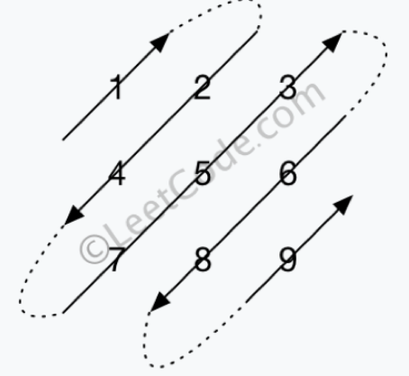

### 498. Diagonal Traverse

https://leetcode.com/problems/diagonal-traverse/

---

#### Problem Description:

Given a matrix of M x N elements (M rows, N columns), return all elements of the matrix in diagonal order as shown in the below image.

###### Example:

**Input**:
[
[ 1, 2, 3 ],
[ 4, 5, 6 ],
[ 7, 8, 9 ]
]
**Output**: [1,2,4,7,5,3,6,8,9]
**Explanation**:

---

###### Idea:

row index: r
column index: c

`r + c` are equals in each diagonal line.

There are 2 types od direction in the diagonal line,
and you distinguish the direction via `(r+c) % 2 == 0`

There are only 3 situations in each diagonal traversing round:

1. Not yet hit the border and keep the direction.
2. Hit the **top/right** border when traversing from `bottom left` to `upper right`.
3. Hit the **bottom/left** border when traversing from `upper right` to `bottom left`.

**Time Complexity**: O( M \* N), M & N : rows count and columns count
**Space Complexity**: O( M \* N), M & N : rows count and columns count
